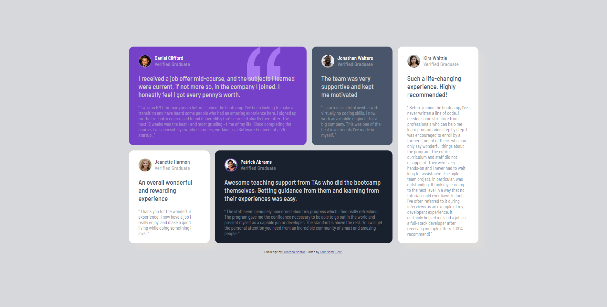

# Frontend Mentor - Testimonials grid section solution

This is a solution to the [Testimonials grid section challenge on Frontend Mentor](https://www.frontendmentor.io/challenges/testimonials-grid-section-Nnw6J7Un7). Frontend Mentor challenges help you improve your coding skills by building realistic projects.

## Table of contents

- [Overview](#overview)
  - [The challenge](#the-challenge)
  - [Screenshot](#screenshot)
  - [Links](#links)
- [My process](#my-process)
  - [Built with](#built-with)
  - [Useful resources](#useful-resources)
- [Author](#author)

**Note: Delete this note and update the table of contents based on what sections you keep.**

## Overview

### The challenge

Users should be able to:

- View the optimal layout for the site depending on their device's screen size

### Screenshot

### Links

- Solution URL: [solution](https://github.com/Lucknagh/testimonials-grid-section-main)
- Live Site URL: [live site](https://66a00b8ca909f131b4b8a554--effulgent-mermaid-d610d0.netlify.app)

## My process

### Built with

- Semantic HTML5 markup
- CSS custom properties
- Flexbox
- CSS Grid
- Mobile-first workflow

### Useful resources

- [Grid](https://origamid.com/projetos/css-grid-layout-guia-completo/) - This is an amazing article which helped me finally understand Grid. I'd recommend it to anyone still learning this concept.

## Author

- Frontend Mentor - [@Lucknagh](https://www.frontendmentor.io/profile/Lucknagh)
